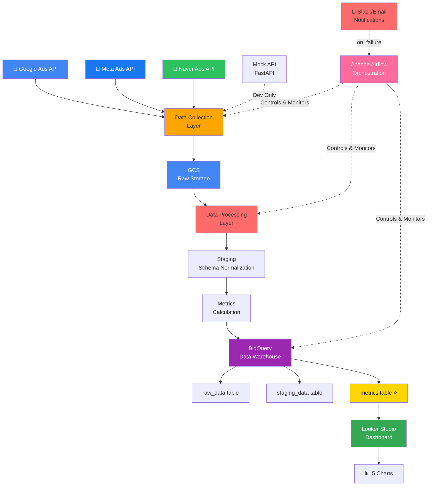

# 🏗️ 광고 캠페인 분석 자동화 플랫폼 - 아키텍처

**문서 작성일**: 2025-11-29
**최종 수정일**: 2025-11-29

---

## 📌 목차
1. [전체 데이터 흐름](#전체-데이터-흐름)
2. [시스템 아키텍처](#시스템-아키텍처)
3. [레이어별 구성](#레이어별-구성)
4. [기술 스택](#기술-스택)
5. [폴더 구조](#폴더-구조)
6. [데이터 흐름 상세](#데이터-흐름-상세)
7. [배포 다이어그램](#배포-다이어그램)

---

## 전체 데이터 흐름

```
┌──────────────────────────────────────────────────────────────────────┐
│                          Daily Pipeline (매일 새벽 3시)               │
└──────────────────────────────────────────────────────────────────────┘

Step 1: 데이터 수집 (2시 ~ 3시)
   Google Ads ──┐
   Meta Ads    ├──→ [API 호출] → Raw JSON/CSV
   Naver Ads   └──→ (수집 오류 시 Mock API 사용 가능)

       ↓

Step 2: Raw 데이터 저장
   GCS Bucket: gs://bucket/raw/{channel}/{year}/{month}/{day}/data.json
   └─ Partitioned by date (year/month/day)

       ↓

Step 3: 데이터 정제 & 정규화 (Staging)
   Raw Data → [Schema Normalization] → Staging Schema
   ├─ Google 필드 매핑
   ├─ Meta 필드 매핑
   └─ Naver 필드 매핑

       ↓

Step 4: 지표 계산 (Metrics)
   Staging → [계산 로직] → Metrics with indicators
   ├─ CTR: clicks / impressions
   ├─ CPC: spend / clicks
   ├─ CPA: spend / conversions
   ├─ ROAS: sales / spend ⭐ (가장 중요)
   └─ CVR: conversions / clicks

       ↓

Step 5: BigQuery 적재 (3계층)
   raw_data table (원본)
       ↓
   staging_data table (정규화)
       ↓
   metrics table (계산 지표)

   └─ Partition by date, Cluster by campaign_id

       ↓

Step 6: Looker Studio 대시보드 (매일 새벽 4시 자동 리프레시)
   [5개 차트]
   ├─ 채널별 ROAS 추이 (Line)
   ├─ 캠페인별 성과 (Table)
   ├─ Top/Bottom 5 (Bar)
   ├─ 채널별 광고비 (Pie)
   └─ 일일 전환율 (Area)

       ↓

Step 7: 알림 (실패 시)
   Slack Notification → 실시간 알림
   Email Report → 일일 리포트
```

---

## 시스템 아키텍처 (Mermaid)



### 고수준 아키텍처 (High-Level)

```
┌─────────────────────────────────────────────────────────────┐
│                     광고 플랫폼 (External)                   │
├──────────────────────────────────────────────────────────────┤
│  Google Ads      Meta Ads      Naver Ads      (+ Mock API)   │
└─────────────┬──────────────────┬──────────────────┬──────────┘
              │                  │                  │
              └──────────────────┴──────────────────┘
                        ↓
        ┌───────────────────────────────────────┐
        │   Data Collection Layer (Python)       │
        │  ┌─────────────────────────────────┐  │
        │  │ - google_ads.py                 │  │
        │  │ - meta_ads.py                   │  │
        │  │ - naver_ads.py                  │  │
        │  │ - error_handling.py             │  │
        │  └─────────────────────────────────┘  │
        └────────────────┬───────────────────────┘
                         ↓
        ┌───────────────────────────────────────┐
        │    Cloud Storage Layer (GCS)           │
        │  gs://bucket/raw/{channel}/yyyy/mm/dd │
        └────────────────┬───────────────────────┘
                         ↓
        ┌───────────────────────────────────────┐
        │   Data Processing Layer (Python)       │
        │  ┌─────────────────────────────────┐  │
        │  │ - staging.py (정규화)           │  │
        │  │ - metrics.py (지표 계산)        │  │
        │  │ - validators.py (데이터 검증)   │  │
        │  └─────────────────────────────────┘  │
        └────────────────┬───────────────────────┘
                         ↓
        ┌───────────────────────────────────────┐
        │  Orchestration Layer (Apache Airflow)  │
        │  ┌─────────────────────────────────┐  │
        │  │ - marketing_pipeline.py (DAG)   │  │
        │  │ - cron: 0 3 * * * (매일 3시)    │  │
        │  │ - Slack/Email notification      │  │
        │  └─────────────────────────────────┘  │
        │  🐳 Docker Compose 환경               │
        └────────────────┬───────────────────────┘
                         ↓
        ┌───────────────────────────────────────┐
        │   Data Warehouse Layer (BigQuery)      │
        │  ┌─────────────────────────────────┐  │
        │  │ raw_data (원본 데이터)          │  │
        │  │ staging_data (정규화)           │  │
        │  │ metrics (계산 지표) ⭐          │  │
        │  └─────────────────────────────────┘  │
        └────────────────┬───────────────────────┘
                         ↓
        ┌───────────────────────────────────────┐
        │   BI & Visualization Layer              │
        │  ┌─────────────────────────────────┐  │
        │  │ Looker Studio Dashboard         │  │
        │  │ - Auto-refresh at 04:00 UTC     │  │
        │  │ - 5+ Charts                     │  │
        │  └─────────────────────────────────┘  │
        └───────────────────────────────────────┘
```

---

## 레이어별 구성

### 1️⃣ **Data Collection Layer** (데이터 수집)

**담당**: 광고 플랫폼 API 연동

| 구성 요소 | 기술 | 역할 |
|----------|------|------|
| Google Ads Connector | `google-ads-python` | Google Ads API 호출 |
| Meta Ads Connector | `requests` + Graph API | Meta Ads API 호출 |
| Naver Ads Connector | REST API | Naver Ads API 호출 |
| Mock API | FastAPI | 테스트/개발용 샘플 데이터 |
| Error Handler | try/except | API 실패 시 재시도 및 로깅 |

**수집 데이터**:
```json
{
  "campaign_id": "12345",
  "campaign_name": "Winter Campaign",
  "impressions": 10000,
  "clicks": 500,
  "spend": 50000,
  "conversions": 25,
  "sales": 150000
}
```

**레이어 위치**: `src/collectors/`

---

### 2️⃣ **Cloud Storage Layer** (클라우드 저장)

**담당**: Raw 데이터 장기 보관

| 구성 요소 | 기술 | 역할 |
|----------|------|------|
| GCS Bucket | Google Cloud Storage | Raw 데이터 저장 |
| 파티셔닝 | year/month/day | 효율적인 관리 |
| 보존 정책 | 90일 이상 | 규정 준수 |

**저장 구조**:
```
gs://marketing-bucket/
├── raw/
│   ├── google_ads/2025/12/10/data.json
│   ├── meta_ads/2025/12/10/data.json
│   └── naver_ads/2025/12/10/data.json
```

**레이어 위치**: `src/processors/raw_storage.py`

---

### 3️⃣ **Data Processing Layer** (데이터 처리)

**담당**: Raw → Staging → Metrics 변환

| 구성 요소 | 기술 | 역할 |
|----------|------|------|
| Schema Normalizer | Pandas | 채널별 필드 정규화 |
| Metrics Calculator | NumPy/Pandas | 지표 계산 |
| Data Validator | Pydantic | 데이터 품질 검증 |
| Logger | Python logging | 처리 과정 로깅 |

**정규화 프로세스**:
```
Google Raw Data
├─ campaign.id → campaign_id
├─ campaign.name → campaign_name
├─ metrics.costMicros (마이크로단위) → spend (원화)
└─ ...

Meta Raw Data
├─ campaign_id → campaign_id
├─ campaign_name → campaign_name
├─ spend (마이크로단위) → spend (원화)
└─ ...

Naver Raw Data
├─ campaignId → campaign_id
├─ campaignName → campaign_name
├─ cost → spend
└─ ...

↓ (모두 동일 스키마로)

Staging Data
{
  date, campaign_id, campaign_name, channel,
  impressions, clicks, spend, conversions, sales
}
```

**지표 계산**:
```python
metrics = {
    'ctr': clicks / impressions,  # Click-Through Rate
    'cpc': spend / clicks,         # Cost Per Click
    'cpa': spend / conversions,    # Cost Per Acquisition
    'roas': sales / spend,         # Return on Ad Spend ⭐
    'cvr': conversions / clicks    # Conversion Rate
}
```

**레이어 위치**: `src/processors/`

---

### 4️⃣ **Orchestration Layer** (오케스트레이션)

**담당**: 전체 파이프라인 스케줄링 및 모니터링

| 구성 요소 | 기술 | 역할 |
|----------|------|------|
| Airflow Scheduler | Apache Airflow | 매일 3시 자동 실행 |
| DAG | marketing_pipeline.py | Task 의존성 정의 |
| Error Notifier | Slack + Email | 실패 알림 |
| Monitoring | Airflow UI | 실행 상태 추적 |

**DAG 구조**:
```
marketing_ads_pipeline (DAG)
├─ [Parallel] collect_google, collect_meta, collect_naver
├─ save_raw_data
├─ process_staging
├─ calculate_metrics
└─ load_to_bigquery

Schedule: 0 3 * * * (매일 새벽 3시)
Retry: 3회 (5분 간격)
```

**레이어 위치**: `airflow/dags/marketing_pipeline.py`

---

### 5️⃣ **Data Warehouse Layer** (데이터 웨어하우스)

**담당**: 데이터 저장 및 쿼리 제공

| 구성 요소 | 기술 | 역할 |
|----------|------|------|
| BigQuery | Google BigQuery | 데이터 웨어하우스 |
| Raw Table | raw_data | 원본 JSON 저장 |
| Staging Table | staging_data | 정규화 데이터 |
| Metrics Table | metrics | 계산 지표 (마스터) ⭐ |
| Partitioning | date | 쿼리 성능 최적화 |
| Clustering | campaign_id | 필터링 성능 향상 |

**테이블 스키마**:
```sql
-- Raw Table
CREATE TABLE raw_data (
  ingestion_time TIMESTAMP,
  source_data JSON,
  channel STRING
)
PARTITION BY DATE(ingestion_time);

-- Staging Table
CREATE TABLE staging_data (
  date DATE,
  campaign_id STRING,
  campaign_name STRING,
  channel STRING,
  impressions INT64,
  clicks INT64,
  spend FLOAT64,
  conversions INT64,
  sales FLOAT64
)
PARTITION BY date
CLUSTER BY campaign_id;

-- Metrics Table (가장 중요)
CREATE TABLE metrics (
  date DATE,
  campaign_id STRING,
  campaign_name STRING,
  channel STRING,
  impressions INT64,
  clicks INT64,
  spend FLOAT64,
  conversions INT64,
  sales FLOAT64,
  ctr FLOAT64,      -- Click-Through Rate
  cpc FLOAT64,      -- Cost Per Click
  cpa FLOAT64,      -- Cost Per Acquisition
  roas FLOAT64,     -- Return on Ad Spend ⭐
  cvr FLOAT64       -- Conversion Rate
)
PARTITION BY date
CLUSTER BY campaign_id;
```

**레이어 위치**: `src/warehouse/`

---

### 6️⃣ **BI & Visualization Layer** (대시보드)

**담당**: 경영진 및 마케터를 위한 실시간 인사이트

| 구성 요소 | 기술 | 역할 |
|----------|------|------|
| BI Tool | Looker Studio | 대시보드 구성 |
| Data Source | BigQuery metrics | 실시간 데이터 연결 |
| Auto-Refresh | 04:00 UTC 매일 | 자동 업데이트 |
| Charts | 5개 이상 | 다양한 시각화 |

**5개 필수 차트**:
1. **채널별 ROAS 추이** (Line Chart)
   - X축: 날짜, Y축: ROAS
   - 채널별 색상 구분

2. **캠페인별 성과 지표** (Table)
   - campaign_id, campaign_name, channel, roas, spend, conversions

3. **Top/Bottom 5 ROAS 캠페인** (Bar Chart)
   - 상위 5 / 하위 5 캠페인

4. **채널별 광고비 분배** (Pie Chart)
   - Google/Meta/Naver 광고비 비율

5. **일일 전환율 추이** (Area Chart)
   - 날짜별 CVR 변화

**자동 리프레시**: 매일 새벽 04:00 UTC (DAG 완료 후 1시간)

---

## 기술 스택

### Backend & Data Processing

| 카테고리 | 기술 | 버전 | 용도 |
|---------|------|------|------|
| **Language** | Python | 3.9+ | 전체 파이프라인 |
| **Ads APIs** | google-ads | 21.0.0 | Google Ads 수집 |
| | requests | 2.31.0 | Meta/Naver API 호출 |
| **Data Processing** | pandas | 2.1.0 | 데이터 정제 |
| | numpy | 1.24.0 | 수치 계산 |
| **Validation** | pydantic | 2.0.0 | 스키마 검증 |
| **Cloud** | google-cloud-bigquery | 3.14.0 | BigQuery 연동 |
| | google-cloud-storage | 2.10.0 | GCS 연동 |
| **Orchestration** | apache-airflow | 2.7.0 | 파이프라인 오케스트레이션 |
| **Monitoring** | python-dotenv | 1.0.0 | 환경변수 관리 |

### Infrastructure

| 카테고리 | 기술 | 용도 |
|---------|------|------|
| **Containerization** | Docker | 지역 개발 및 배포 |
| | Docker Compose | Airflow 로컬 환경 |
| **Cloud Platform** | Google Cloud Platform | BigQuery, GCS, Compute |
| **Code Repository** | Git | 버전 관리 |

### BI & Visualization

| 카테고리 | 기술 | 용도 |
|---------|------|------|
| **BI Tool** | Looker Studio | 대시보드 구성 |
| **Query Language** | SQL | BigQuery 쿼리 |
| **Notification** | Slack API | 실패 알림 |
| | SMTP (Gmail) | 이메일 알림 |

---

## 폴더 구조

```
marketing_roas/
│
├── docs/                                    # 문서
│   ├── PROJECT_REQUIREMENTS.md              # 프로젝트 요구사항
│   ├── ARCHITECTURE.md                      # 이 파일
│   ├── WEEK1_SETUP.md                       # 1주차 일정
│   ├── WEEK2_COLLECTION.md                  # 2주차 일정
│   ├── WEEK3_PROCESSING.md                  # 3주차 일정
│   ├── WEEK4_ORCHESTRATION.md               # 4주차 일정
│   ├── API_SETUP.md                         # API 설정 가이드 (준비 중)
│   └── DEPLOYMENT.md                        # 배포 가이드 (준비 중)
│
├── src/                                     # 소스 코드
│   ├── __init__.py
│   ├── config.py                            # 환경 설정 로드
│   │
│   ├── collectors/                          # 데이터 수집 모듈
│   │   ├── __init__.py
│   │   ├── google_ads.py                    # Google Ads API 커넥터
│   │   ├── meta_ads.py                      # Meta Ads API 커넥터
│   │   ├── naver_ads.py                     # Naver Ads API 커넥터
│   │   └── mock_api.py                      # Mock 데이터 생성 (테스트용)
│   │
│   ├── processors/                          # 데이터 처리 모듈
│   │   ├── __init__.py
│   │   ├── raw_storage.py                   # Raw 데이터 GCS 저장
│   │   ├── staging.py                       # 스키마 정규화
│   │   ├── metrics.py                       # 지표 계산 (CTR, CPC, ROAS 등)
│   │   └── validators.py                    # 데이터 품질 검증
│   │
│   ├── warehouse/                           # DWH 모듈
│   │   ├── __init__.py
│   │   ├── bigquery.py                      # BigQuery 클라이언트
│   │   ├── schemas.py                       # 테이블 스키마 정의
│   │   └── sql/
│   │       ├── raw.sql                      # Raw 테이블 쿼리
│   │       ├── staging.sql                  # Staging 쿼리
│   │       └── metrics.sql                  # Metrics 쿼리
│   │
│   └── utils/                               # 유틸리티
│       ├── __init__.py
│       ├── logger.py                        # 로깅 설정
│       ├── slack_notifier.py                # Slack 알림
│       └── error_handler.py                 # 에러 처리
│
├── airflow/                                 # Airflow 설정
│   ├── dags/
│   │   ├── __init__.py
│   │   └── marketing_pipeline.py            # 메인 DAG (매일 3시 실행)
│   │
│   ├── plugins/
│   │   └── operators/                       # 커스텀 Operator (필요시)
│   │
│   └── config/
│       └── airflow.cfg                      # Airflow 설정 파일
│
├── tests/                                   # 테스트 코드
│   ├── __init__.py
│   ├── test_collectors.py                   # 수집 모듈 테스트
│   ├── test_processors.py                   # 처리 모듈 테스트
│   └── test_e2e.py                          # E2E 테스트
│
├── data/                                    # 샘플 데이터 (버전 관리 X)
│   ├── sample_google_ads.json
│   ├── sample_meta_ads.json
│   └── sample_naver_ads.json
│
├── docker-compose.yml                       # Airflow 로컬 환경 설정
├── requirements.txt                         # Python 패키지 의존성
├── .env.example                             # 환경변수 템플릿 (Git 제외)
├── .gitignore                               # Git 제외 파일
├── setup.py                                 # 패키지 설정
├── README.md                                # 프로젝트 개요
└── LICENSE                                  # 라이센스
```

---

## 데이터 흐름 상세

### Daily Pipeline Timeline

```
타임라인:
────────────────────────────────────────────────────────────

02:00 ~ 03:00 | 데이터 수집 (Collection)
  └─ Google Ads API 호출 → JSON 변환
  └─ Meta Ads API 호출 → JSON 변환
  └─ Naver Ads API 호출 → JSON 변환
  └─ (실패 시) Mock API로 대체

03:00 | Airflow DAG 트리거 (Orchestration)
  └─ marketing_ads_pipeline DAG 시작

03:05 ~ 03:10 | Raw 데이터 저장 (Storage)
  └─ GCS에 JSON 파일 저장
  └─ 경로: gs://bucket/raw/{channel}/2025/12/20/data.json

03:10 ~ 03:15 | Staging 정규화 (Processing)
  └─ Raw JSON → Pandas DataFrame
  └─ 채널별 필드 매핑
  └─ 스키마 통일

03:15 ~ 03:20 | 지표 계산 (Metrics)
  └─ CTR = clicks / impressions
  └─ CPC = spend / clicks
  └─ ROAS = sales / spend ⭐

03:20 ~ 03:30 | BigQuery 적재 (Warehouse)
  └─ raw_data 테이블 적재
  └─ staging_data 테이블 적재
  └─ metrics 테이블 적재

03:30 | DAG 완료
  └─ Slack: "✅ Pipeline completed successfully"

04:00 | Looker Studio 자동 리프레시
  └─ BigQuery 데이터 새로고침
  └─ 대시보드 차트 업데이트

📊 최종 결과: 어제 데이터가 Looker Studio에 표시됨
```

---

## 배포 다이어그램

### Development Environment (로컬)

```
├─ Python 3.9+ (venv)
├─ Docker Desktop
│  └─ Docker Compose
│     ├─ Airflow Webserver (http://localhost:8080)
│     ├─ Airflow Scheduler
│     ├─ Airflow Worker
│     └─ PostgreSQL (메타DB)
│
├─ GCP 프로젝트 (개발용)
│  ├─ BigQuery Dataset: marketing_analytics
│  ├─ GCS Bucket: gs://dev-bucket
│  └─ Service Account 키: dev-sa-key.json
│
└─ Mock API (FastAPI)
   └─ http://localhost:8000
```

### Production Environment (GCP)

```
├─ Cloud Composer (Airflow 관리형)
│  └─ DAG: marketing_pipeline.py
│     └─ 매일 03:00 UTC 실행
│
├─ Cloud Storage (GCS)
│  └─ Raw 데이터 저장 (90일 보관)
│
├─ BigQuery
│  ├─ raw_data 테이블
│  ├─ staging_data 테이블
│  └─ metrics 테이블
│
├─ Cloud Run (선택사항)
│  └─ 실시간 API 서버
│
├─ Cloud Monitoring
│  └─ Airflow 작업 모니터링
│
└─ Looker Studio
   └─ 대시보드 (metrics 테이블 연결)
```

---

## 주요 설계 결정사항

| 결정사항 | 선택 | 이유 |
|---------|------|------|
| **오케스트레이션 도구** | Airflow | 복잡한 DAG 구성, 재시도, 모니터링 우수 |
| **데이터 웨어하우스** | BigQuery | 서버리스, 비용 효율적, SQL 표준 |
| **클라우드 스토리지** | GCS | BigQuery와 네이티브 통합 |
| **BI Tool** | Looker Studio | 무료, Google과 통합 |
| **언어** | Python | 데이터 처리 표준, 라이브러리 풍부 |
| **파티셔닝** | date | 일일 파이프라인에 최적 |
| **클러스터링** | campaign_id | 마케팅팀의 주요 분석 차원 |
| **스케줄** | 03:00 UTC | 야간 배치 처리 표준 |

---

## 성능 목표

| 지표 | 목표 | 실현 방법 |
|------|------|---------|
| **파이프라인 지연** | < 10분 | BigQuery 파티션 프루닝 |
| **데이터 신선도** | 일 1회 (새벽) | 03:00 UTC 스케줄 |
| **가용성** | 99% | 자동 재시도 + 에러 알림 |
| **쿼리 성능** | < 30초 | 파티션 + 클러스터링 |
| **저장 비용** | < $100/월 | Raw 90일 보관, 효율적 스키마 |

---

## 보안 및 규정

| 항목 | 조치 | 설명 |
|------|------|------|
| **인증** | OAuth 2.0 | Google/Meta/Naver API 인증 |
| **데이터 암호화** | TLS/SSL | 통신 암호화 |
| **접근 제어** | IAM | GCP 서비스 계정 권한 최소화 |
| **감사 로그** | Cloud Logging | 모든 작업 기록 |
| **데이터 보관** | 90일 | 컴플라이언스 준수 |

---

## 모니터링 & 알림

### Monitoring

- **Airflow UI**: Task 실행 상태 추적
- **Cloud Logging**: 파이프라인 로그 확인
- **BigQuery UI**: 데이터 품질 확인
- **Looker Studio**: 대시보드 데이터 검증

### Alerting

- **Slack**: DAG 실패 시 실시간 알림
- **Email**: 일일 실행 리포트
- **Cloud Alerts**: 비용 이상, 스토리지 부족 등

---

## 마이그레이션 & 확장 계획

### Phase 1 (현재)
- 3개 채널 (Google, Meta, Naver)
- 일 1회 배치 처리
- 정적 대시보드

### Phase 2 (향후)
- 실시간 스트리밍 추가
- 추가 채널 (Kakao, 당근, 중고나라)
- 머신러닝 기반 이상탐지

### Phase 3 (최종)
- 예측 분석 (ROAS 예측)
- 자동 최적화 (예산 조정)
- 모바일 앱 제공

---

## 문제 해결 가이드

### 일반적인 이슈

| 문제 | 원인 | 해결 방법 |
|------|------|---------|
| API 호출 실패 | 인증 토큰 만료 | Refresh Token 갱신 |
| BigQuery 쿼리 느림 | 파티션 조건 없음 | WHERE date = ... 추가 |
| 대시보드 데이터 없음 | 리프레시 미실행 | 수동 리프레시 또는 스케줄 확인 |
| Airflow DAG 충돌 | 스케줄 겹침 | 스케줄 간격 조정 |
| GCS 저장 실패 | 권한 부족 | Service Account 권한 확인 |

---

## 다음 단계

1. **1주차**: 이 아키텍처를 기반으로 환경 설정 시작
2. **2주차**: API 커넥터 개발 (아키텍처의 Collection Layer)
3. **3주차**: 데이터 처리 파이프라인 (Processors → Warehouse)
4. **4주차**: Airflow DAG 작성 및 배포 (Orchestration → BI)

---

**이 아키텍처 문서를 참고하며 각 주차 계획을 진행하세요!** 🚀
